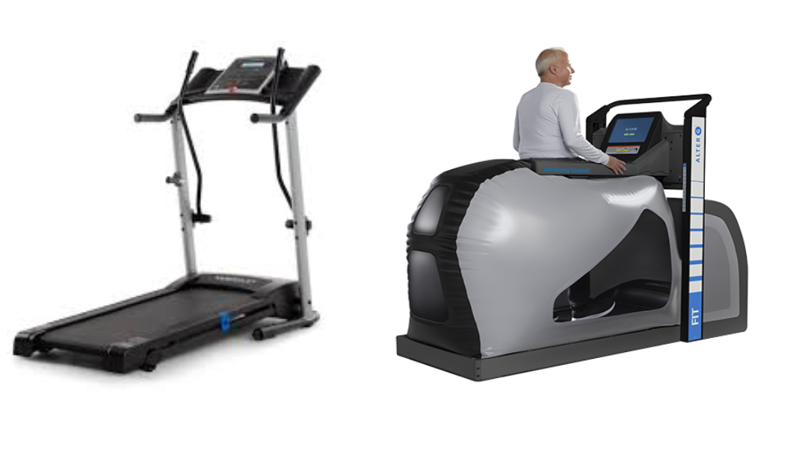

# MECA 482 Spring 2020
### Treadmill Stabilizer 

-------------------------------------------------------------------------------------

Control System Design of Low Impact Treadmill

-------------------------------------------------------------------------------------

  

   <h4> California State University Chico</h4>
   <h4> College of Engineering, Computer Science, and Construction Management</h4> 
   <h4> MECA 482 Control System Design</h4> 
   <h4> Control System Design of Low Impact Treadmill</h4> 

## 1. Introduction 
The actively damped treadmill system consists of a treadmill and suspension system which reduces the peak reaction force felt by an object impacting the treadmill. The control is achieved by tuning the damping and spring coefficients in the suspension system, taking into account the spring and damping coefficients of the frame itself. The Project Team’s goal is to develop a comprehensive solution (explained in more details in the deliverables section) to reduce the impact for any weight within the limits.

#### Table of Contents
- [1. Introduction](#1-Introduction)
- [2. Control Theory Modeling](#2-Control-Theory-Modeling)
- [3. Dynamic Modeling](#3-Dynamic-Modeling) 
- [4. Design and Simulation](#4-Design-and-Simulation)
- [5. Appendix](#5-Appendix)
- [6. References](#6-References)

## 2. Control Theory Modeling
Sample High-Level Architecture:

  

## 3. Dynamic Modeling 

insert system dynamic modeling here....

## 4. Design and Simulation

System simulation was done using Coppelia-Sim. Treadmill spring dampeners were siumulated using prismaic joints with an accompanying 
Lua script in order to simulate a realistic spring with a spring constant value of 566,440 N/M reacting to a downward force of 25 kg
The resulting Coppelia sumulation is shown below

<iframe src="https://drive.google.com/file/d/1iJTwLz7N1gv0qS0AZx7YD2bzRThr-MQ1/preview" width="640" height="480"></iframe>

In addition we alsl simulated a mass-spring system using a Visual Python extension. This allowed for a more accurate representation of the model's spring system. The same values were used to represent with spring with the constant at 566,440 N/M and a downward forcer of 25 kg. In addition to this we were able to model the spring radius, number of coils, and thickness. These values are 1.

insert code snippets here? 

## 5. Appendix

insert references here 

## 6. References

    *** Note other deliverables needed include 
    - mathematical model of system
    - simulink control system
    - coppelia simulation 
